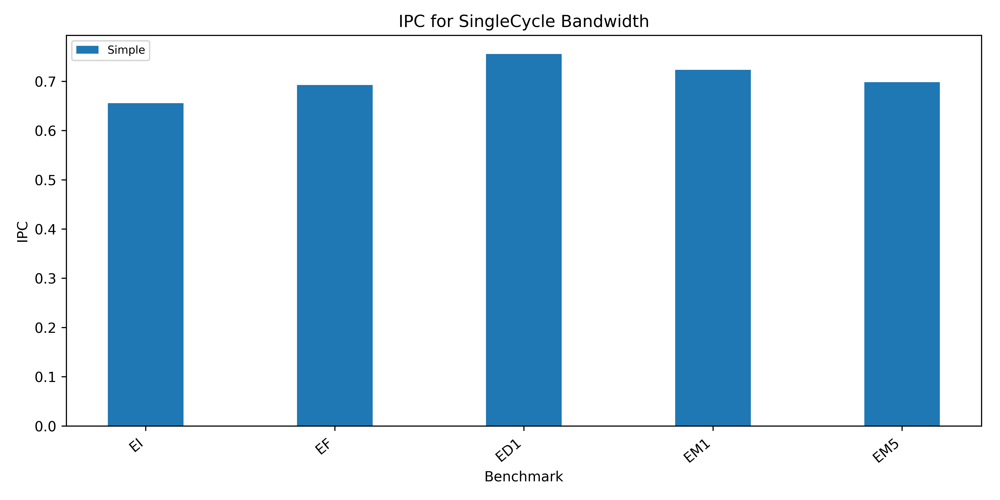
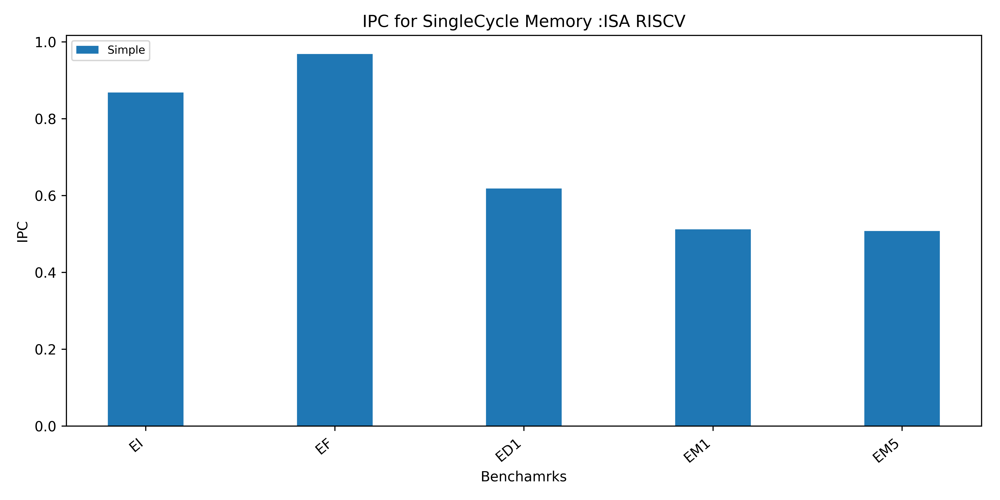
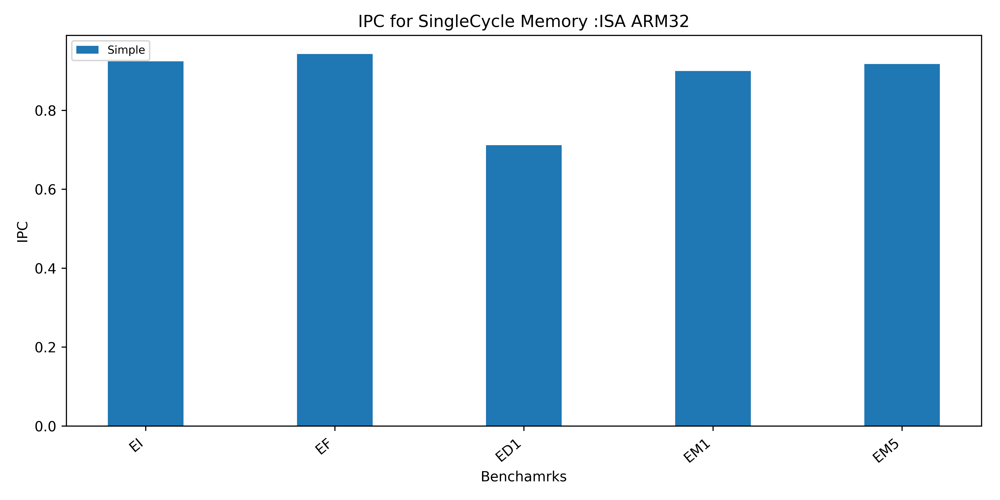

# Finding the Instruction-mix based on IPC 

The TimingSimple CPU is a simple single stage CPU whose IPC is dependent only on the memory and fetch latency.
So when the latency of the memory is set to single cycle, the total number of cycles becomes equal to the number of instruction fetch  and number of memory references.

## Motivation

If we can find the instruction mix from the IPC by running the workload with TImingSimpleCPU in Single cycle latency, it would help us understand the workload better by just looking at IPC.

Comparing this result against a realistic memory can also be used to understand how much does the memory latency affect the overall performance.

 ## Can we find the instruction mix from the IPC or vice versa using the formula below?

``` 

    IPC = Number of instructions/(Number of Inst + Number of mem_ref)
        = 1/(percent_of_arithmetic_instructions + 2* percent_of_mem_refs)

```

If the fetching of one instruction takes exactly one cycle and fetching of one memory reference takes one cycle,it is possible to calculate the instruction mix from the IPC. 
But, the TimingSimpleCPU fetches fixed chunk of '32 bits' for each access to the instruction memory irrespective of the underlying ISA. So, the number of instruction fetches made per instruction varies for different ISA's based on the instruction size and alignement used by the ISA. 

Therefore, the total number of instructions and the total number of instruction fetches are not same for all ISA's.

**ISA-X86** : The X86 ISA has variable length instrcutions,some instructions might take multiple fetch before a complete instruction could be fetched.Therefore the number of instruction fetches made by the CPU is more than the number of instructions in the code.Hence,it is not possible to calculate the exact instruction mixture from just the IPC.

**ISA-RISCV** : The RISCV ISA supports unaligned instructions and compressed unaligned instructions. The unaligned instruction might require two fetches before a complete instruction could be fetched in gem5 RISCV model. Therefore the calculation  of exact instruction mixture from just the IPC might not be accurate when there are mixture of unaligned and aligned instructions present in the code. 

**ISA-ARM** : ARM has a fixed length instruction of '32 bits', therefore, the number of instruction fetches made by the CPU is equal to the number of instructions in the code. It is possible to calculate the exact instruction mixture from just the IPC.


## Results

**ISA-X86** 

The IPC is not the same as calculated IPC due to the variable insturction size in X86.

| Benchmarks | Num of Inst | Num of mem_refs | Calculated IPC | IPC  |
|------------|-------------|-----------------|--------------|------|
| EI         | 16449       | 2392            | 0.87         | 0.65 |
| EF         | 47108       | 2402            | 0.95         | 0.69 |
| ED1        | 26606       | 2386            | 0.91         | 0.75 |
| EM1        | 22507       | 2386            | 0.90         | 0.72 |
| EM5        | 38899       | 2386            | 0.94         | 0.69 |
 




 **ISA-RISCV**

The IPC is not the same as calculated IPC due to unaligned insturctions in RISCV.


| Benchmarks | Num of Inst | Num of mem_refs | Calculated IPC | IPC  |
|------------|-------------|-----------------|--------------|------|
| EI         | 35021       | 876             | 0.97         | 0.81 |
| EF         | 43215       | 892             | 0.98         | 0.96 |
| ED1        | 2240        | 876             | 0.72         | 0.61 |
| EM1        | 18617       | 876             | 0.95         | 0.52 |
| EM5        | 35010       | 876             | 0.97         | 0.50 |





**ISA-ARM**

ARM has a fixed length instruction of 32 bits, therefore the calculated IPC is same as obtained IPC.

| Benchmarks | Num of Inst | Num of mem_refs | Calculated IPC | IPC  |
|------------|-------------|-----------------|--------------|------|
| EI         | 46260       | 3835            | 0.92         | 0.92 |
| EF         | 737813      | 44810           | 0.94         | 0.94 |
| ED1        | 9357        | 3842            | 0.71         | 0.71 |
| EM1        | 33915       | 3834            | 0.90         | 0.90 |
| EM5        | 42118       | 3836            | 0.91         | 0.91 |




## Conclusion

Although TimingSimple CPU a single stage zero latency CPU whose performance depends on just the memory latency, when run with SingleCycle latency, it might take more than one cycle to execute, due to other factors like undrlying ISA.

To find the IPC from the instruction mix, we need to make sure the instruction size and alignment matches with the fetch packet of TimingSimpleCPU.

Fetching an entire cache line rather than just 4 bytes data per instruction fetch in the CPU and storing it in a fetch buffer might help in reducing the number of instruction fetches made.
