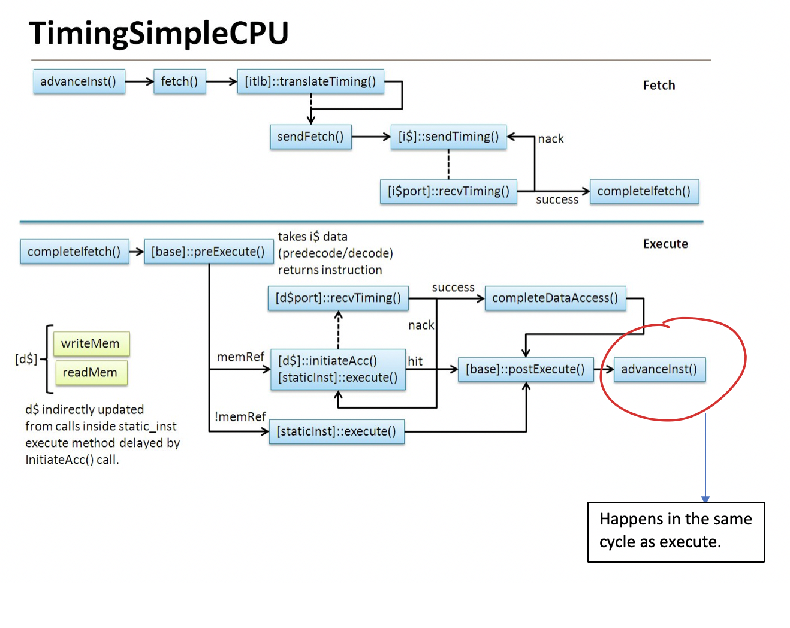
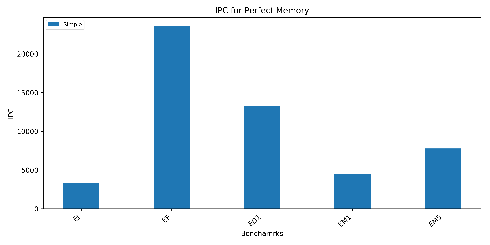

## **Timing Simple CPU:**

The [TimingSimple](http://www.gem5.org/documentation/general_docs/cpu_models/SimpleCPU)  is the version of SimpleCPU that uses timing memory accesses. It has a Single stage pipeline, (Fetch + Execute).
The timing simple advances to "next fetch" in the same cycle as the "execute" stage.

### Execution benchmarks:

The benchmarks used to test the TimingSimpleCPU are execution benchmark suite, which has mostly arithmetic instrcutions. In ideal case, the execution benchmark combined with a single cycle memory latency has to give IPC~1.

The following are the description of the various benchmarks in the execution benchmark suite:

- EI  : 8 Independent Instructions
- EF  : 16 Independent Instructions
- ED1 : 1 Dependency Chain per instruction
- EM1 : 1 dependency chain with multiplies
- EM5 : 5 dependency chain with multiplies

### Memory Latency:

- Perfect : Perfect memory, it takes ‘0ns’ for any memory access.

    To analyse the behaviour of SimpleTimingCPU the CPU, it is useful to run the CPU with a perfect memory to confirm that all the performance of this CPU is only dependent on the memory latency.

- SingleCycle : It takes '1ns' for any memory access.

    It could be useful to run the CPU with single Cycle memory to see if we can obtain IPC~1 for arithmeitc heavy benchmarks and IPC~0.5 for a memory benchamarks.

**The Timing Simple with perfect** 

Since execute and next-fetch happens at the same time, without memory latency (perfect memory), it takes only the initial latency for fetch and every execution happens at zero time and the entire benchmark executes in 1 or 2 cycles, which gives a very high IPC.

**The Timing Simple in Single cycle**

Since this is an execution benchmark suite with only arithmetic independent instruction, the latency we see is mostly because of fetch.

In single-Cycle memory bandwidth, the memory access to fetch takes 1 cycle and hence the IPC largely dependents on the number of instruction fetches made.

**Conclusion**

[TimingSimple](http://www.gem5.org/documentation/general_docs/cpu_models/SimpleCPU) is an in-order 1 stage simple CPU, and could be useful to measure the memory latency involved in benchmarks.
