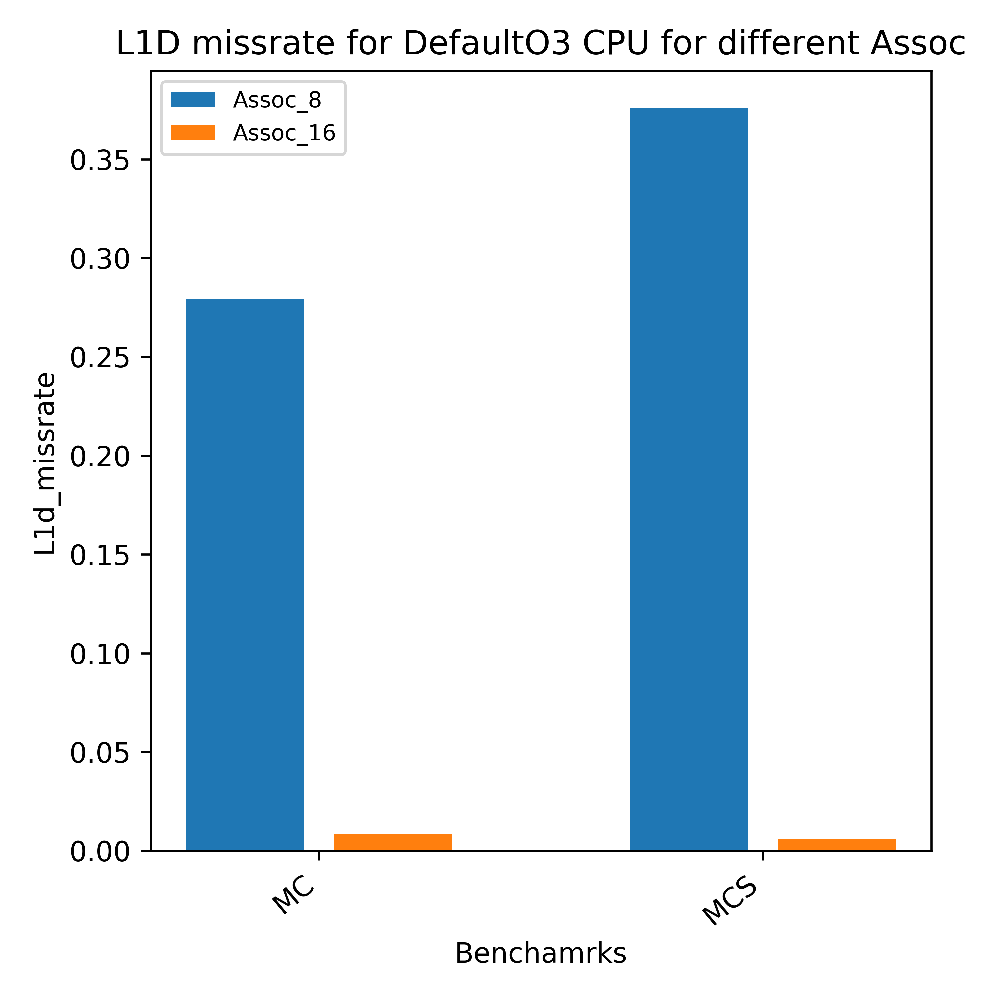
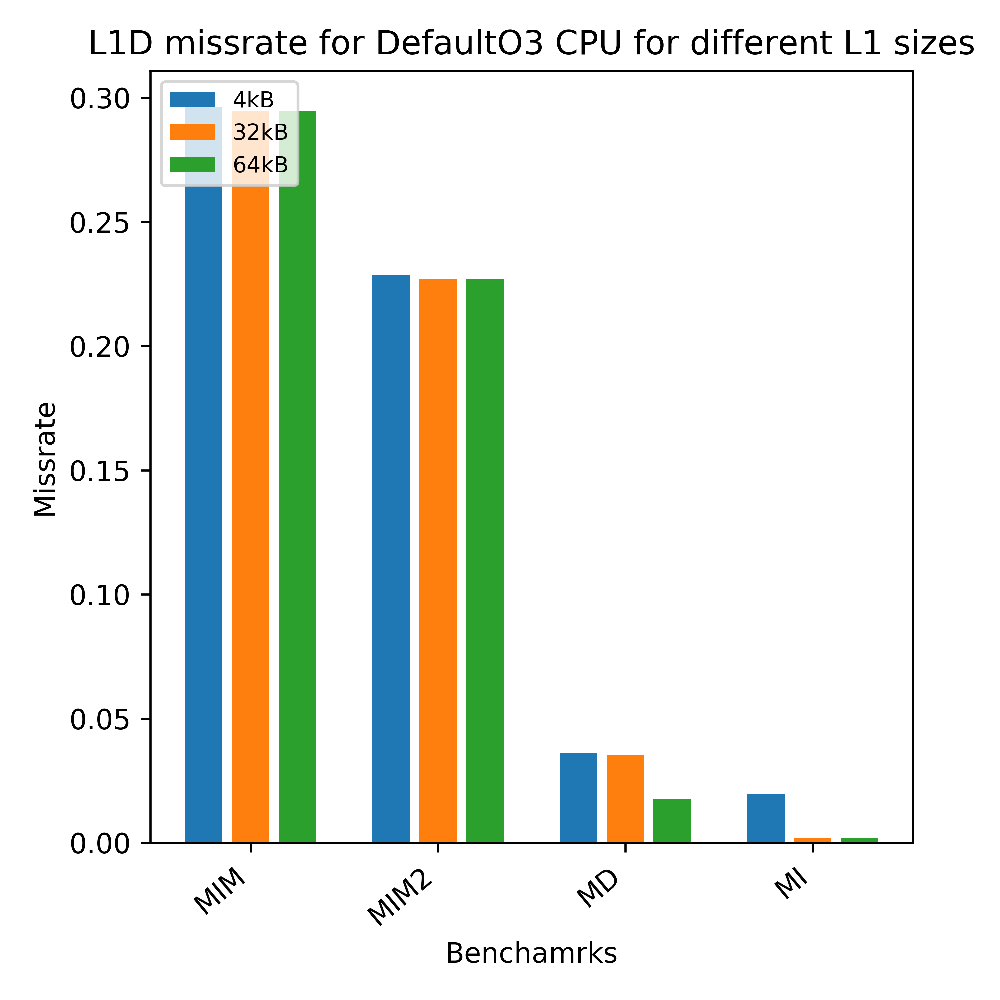
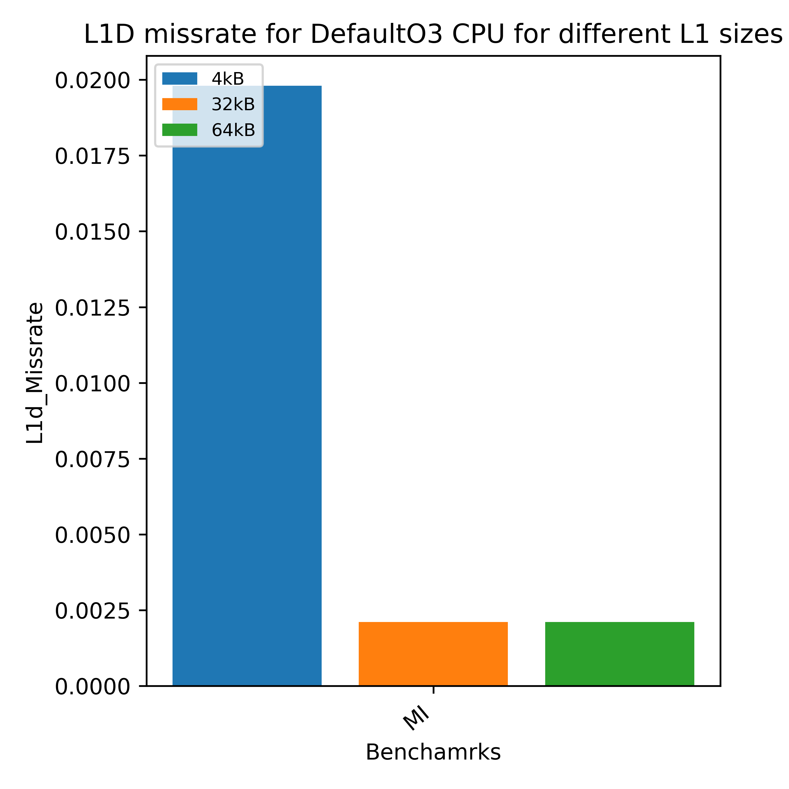
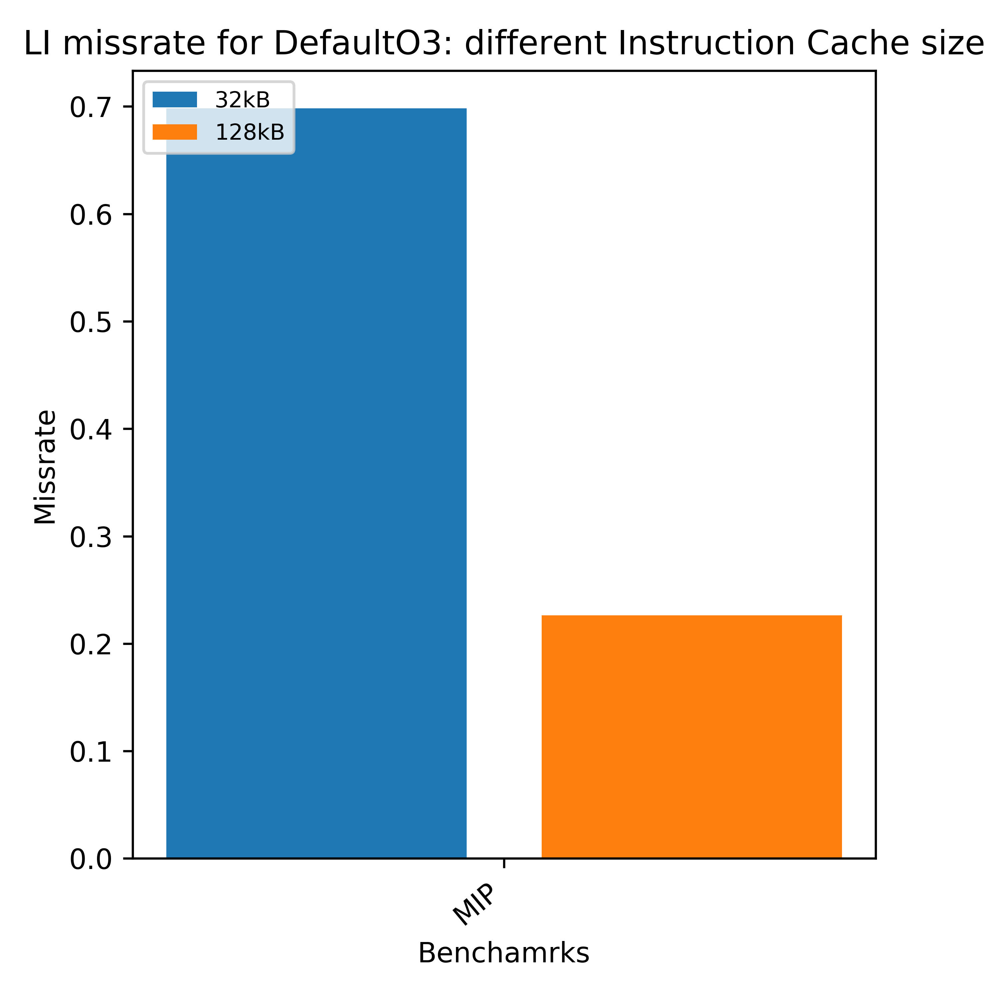
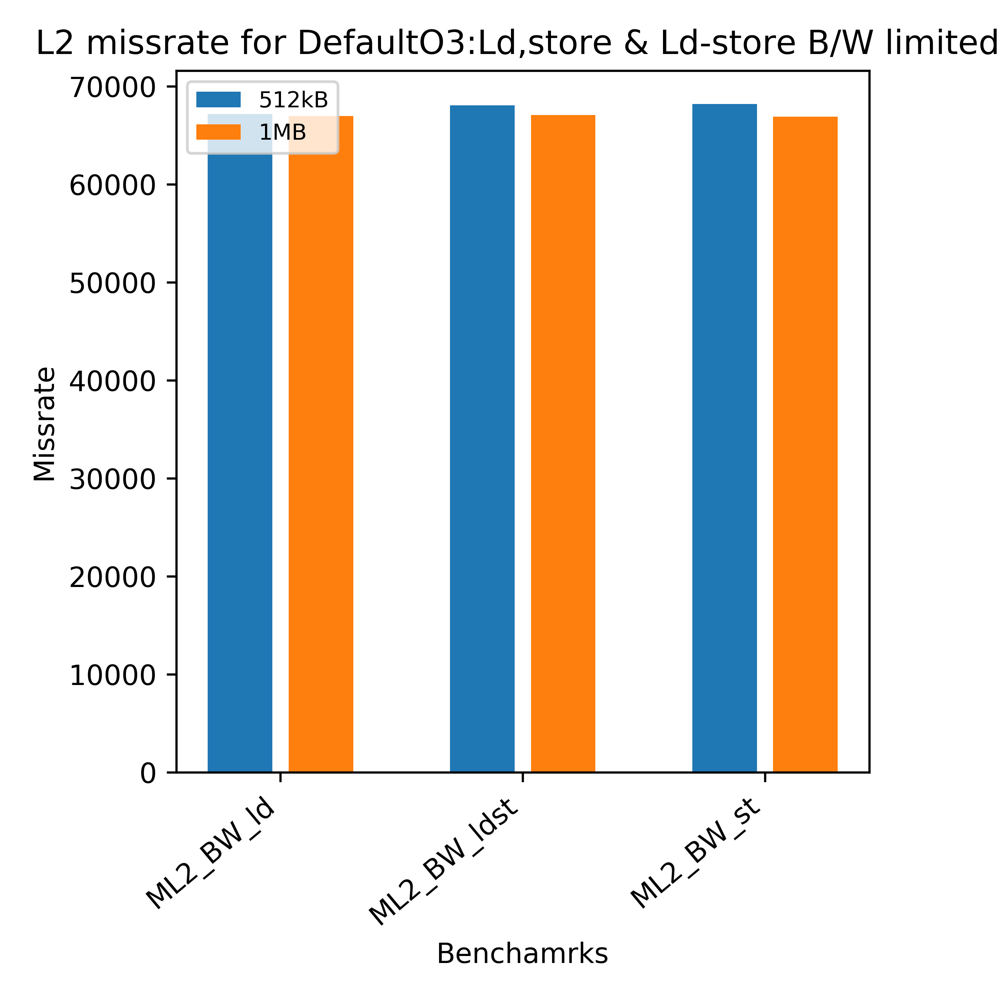

# **Cache Performance**

In this performance analysis experiment, various basic cache misses are tested using some useful [micro-benchmarks](https://github.com/VerticalResearchGroup/microbench) origianlly developed at University of Wisconsin-Madison to ensure that the caches in gem5 work correctly.

### **CPU Models**

**Default O3** : Out of Order CPU model with instruction commit width of 8 and LTAGE branch predictor.

### **Cache Model**

**Classic Caches:** Non-blocking cache with MSHR (miss status holding register) and WB (Write Buffer) for read and write misses. With no prefetcher. Replacement policy is LRU with set associativity of 8.

## **L1D Cache Performance**

### **Conflict Misses**

Conflict  misses occur in benchmarks where several blocks are mapped to the same set or block frame and all of them cannot fit in the set.

**Benchmarks Used to observe this property are:**

-  MC: Benchmark with  load instructions, generates Many Conflict Misses.

- MCS: Benchmark with  store instructions,generates Many Conflict Misses.

**configuration of the cache:**

- L1 Data Size: 32 kB
- Instruction Cache : 32kB
- L2 Cache Size : 1MB
- Assoc: *variable*
- Block Size: 64 byrtes

**Result:**

The code has more than 8  blocks ( it has 9) mapping into the same set, therefore when the associativity is set to 8 the missrate is high due to confict misses, incereasing the associativity (to 16) as expected  reduced the overall miss rate as well as overall mshr miss rate.

### **Capacity Misses**

Generally when a benchmark has bad spatial locality, (refers to the use of data elements within relatively close storage locations) it fills up the cache with unnecessary data leading to cache pollution which leads to more capacity misses in L1 data cache.

**The benchmarks used to observe this property are:**

- MD : Benchmark containing cache resident linked list transversal.
- MI : Independent memory access stored in static array, this benchmark has good spatial and temporal locality.
- MIM : Independent memory access stored in static array, this benchmark has very bad spatial locality.
- MIM2 : Same as MIM, but it has 2 extra coalescing ops in between.

**configuration of the cache:**

- L1 Data Size: *Variable*
- L2 Cache Size : 1MB
- Assoc: 8
- Block Size: 64 bytes

**Result:**

Since MI has  very good spatial locality, it has the least missrate among all the benchmarks. MD  it has better performance as we increase the size of the cache. Whereas MIM and MIM2 have pretty bad spatial locality and therefore have more capacity misses therefore the overall missrate is high.

The memory benchmark 'MD' is a linkedlist transversal, linkedlist due to dynamic allocation of memory usually does not have a good spacial locality. therefroe has more missrate than 'MI'.

The MIM2 has 2 coalescing ops in between which make use of the spacial loclaity a little bit, therefore it has slighlty lesser missrate than MIM. 

As we increase the size of the cache from 4KB to 32Kb the missrate of MD and MI reduces.

### **Compulsory Misses**

When the cache size much bigger than necessary, the number of compulsory misses increases and becomes one of the main cause for increase in the miss rate.

**configuration of the cache:**

- L1 Data Size: Variable
- Instruction Cache : 32Kb
- L2 Cache Size : 1MB
- Assoc: 8
- Block Size: 64 bytes

**The benchmarks used to observe this property are:**

- MI : Independent memory access stored in static array, this benchmark has good spatial and temporal locality.

**Results:** 

As we increase the size of the cache from 32KB to 64Kb the missrate of  MI increases due to compulsory misses.

## **Instruction Cache Performance**

**configuration of the cache:**

- L1 Data Size: 32kB
- Instruction Cache : *variable*
- L2 Cache Size : 1MB
- Assoc:8
- Block Size:64 bytes

**The benchmarks used to observe this property are:**

- MIP: Benchmark with many Instruction Cache Misses.

**Results:** 

As we increase the size of the Instruction cache, the missrate eventually reduces as expected.

## **L2 Cache Performance**

The L2 Cache is tested using benchmark that does linkedlist traversal in of elements residing in L2 cache  

**configuration of the cache:**

- L1 Data Size: 32kB
- Instruction Cache : 32kB
- L2 Cache Size : *variable size*
- Assoc:8
- Block Size:64 bytes

**The benchmarks used to observe this property are:**

- ML2_BW_ld: Linkedlist traversal with BW limited by load instruction.
- ML2_BW_st: Linkedlist traversal with BW limited by store instruction.
- ML2_BW_ldst: Linkedlist traversal with BW limited by load and store instruction.

**Results:**
As we increase the size of the L2 cache, the missrate eventually reduces as expected, but it does not decrease steeply.

 

## **Conclusion:**

The functionality of L1 cache, Instruction cache and L2 cache was analysed with these benchmarks and these benchmarks behaved as expected in the gem5 model with DefaultO3 CPU and Classic memory model.
