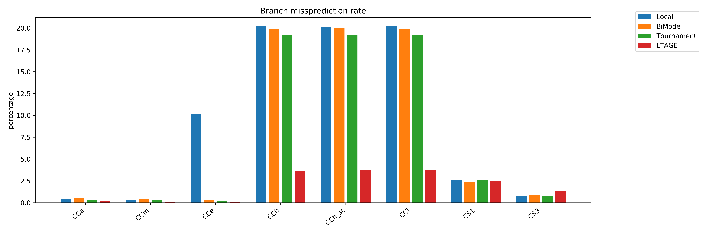
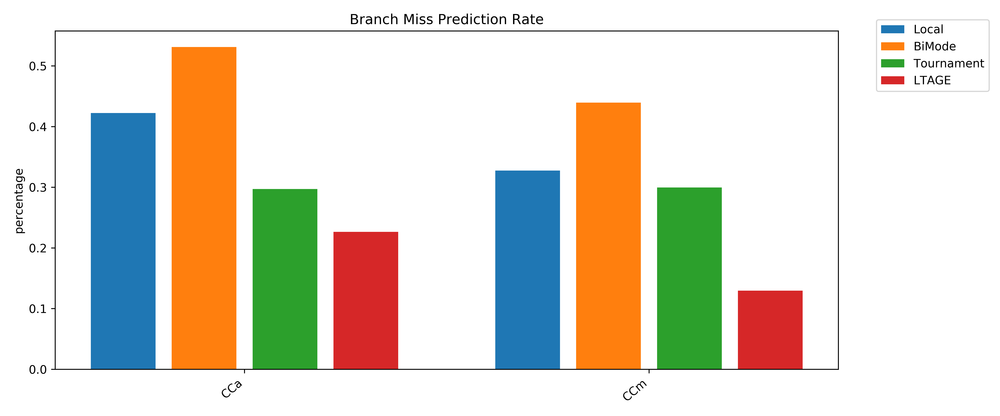
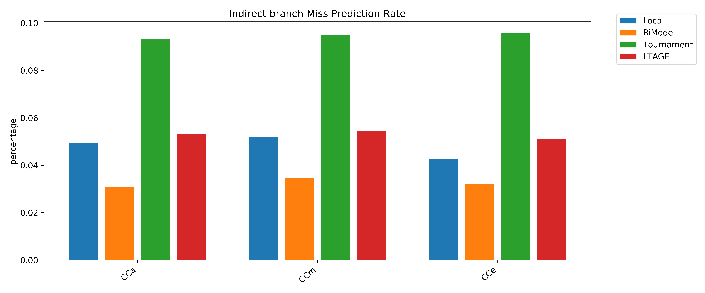
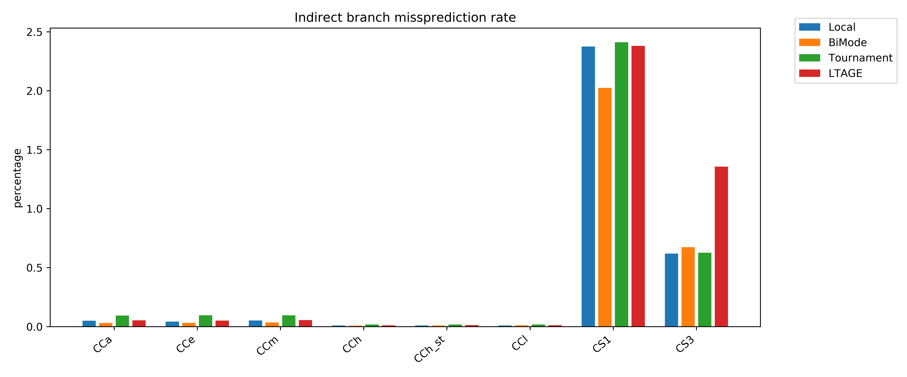

# Branch Predictors

Flow chart for Bpred_unit (to do)

### Indirect Predictor
(to do)

### Local Predictor
The local predictor is a 1 level branch predictor that has a history table in which each entry is a n bit saturating counter. The history table is indexed by the PC, each counter in history table has 2^N states, if it predicts taken, branch target table in the indirector predictor is used obtain the branch address.  

### Bi-mode Predictor
The bi-mode predictor is a two-level branch predictor that has three seprate history arrays: a taken array, a not-taken array, and a choice array. The taken/not-taken arrays are indexed by a hash of the PC and the global history. The choice array is indexed by the PC only. Because the taken/not-taken arrays use the same index, they must be the same size.

The bi-mode branch predictor aims to eliminate the destructive aliasing that occurs when two branches of opposite biases share the same global history pattern. By separating the predictors into taken/not-taken arrays, and using the branch's PC to choose between the two, destructive aliasing is reduced.

### Tournament Predictor
The tournament predictor is a two-level branch predictor, It has a local predictor, which uses a local history table to index into a table of counters, and a global predictor, which uses a global history to index into a table of counters.  A choice predictor chooses between the two.  Both the global history register and the selected local history are speculatively updated.

### LTAGE Predictor
TAGE (TAgged GEometric)is a global-history based branch predictor. It features a PC-indexed bimodal predictor and N partially tagged tables, indexed with a hash of the PC and the global branch history. The different lengths of global branch history used to index the partially tagged tables grow geometrically. A small path history is also used in the hash. L-TAGE also features a loop predictor that records iteration count of loops and predicts accordingly.

All TAGE tables are accessed in parallel, and the one using the longest history that matches provides the prediction (some exceptions apply).Entries are allocated in components using a longer history than the one that predicted when the prediction is incorrect.

## Benchmark Characterization
CCa - completely baised branches\
CCm - heavly baised branches\
CCe - easy to predict -- branch pattern (10101010...)\
CCh - impossible to predict -- random branch pattern\
CCh_st - impossible to predict with a store operation\
CCl - impossible to predict with large penality -- large airthmetic work per branch\
CS1 - switch Case Statement of size 10 -- Different Case each time\
CS3 - switch Case Statement of Size 10 -- Different case every third time\

### Easy to predict
1. Since local BP uses 2bit counters for direction prediction, it gives a bad performance for CCe compared to other BPs because, (101010..) would be a limiting sequence for a 2bit counter. In this case, the expected miss prediction rate is more than 50% but actually it is just 10%, the reason is still unclear.

2. Bi-mode BP is slightly bad at predicting baised benchmarks, this is beacuase the time taken to train taken and not-taken predictor in Bi-mode BP.

3. Need to find out why tournament and LTAGE are bad at indirect prediction (may be because of warmup).

### Immpossible to predict
The goal is to get worst missprediction rates, a random array of 16,384 elements (either 1 or 0) was used to train the predictors. But the predictors perform way better than expected. The reason might be indirection but not sure about this, all of the BPs used here use an indirector predictor for branch target prediction and TAGE uses it for branch direction prediction as well.
Bi-mode and tournamnet predictors can at max use 64 bit  

### Multiway branches

Switch case statements are multiway branches, they are difficult to predict because, the predictor must be have a history of all cases to make a acurrate prediction.
