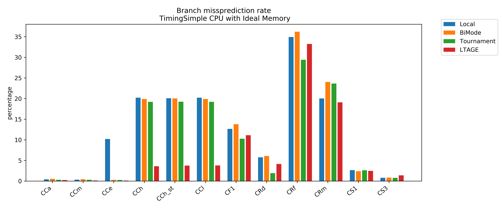
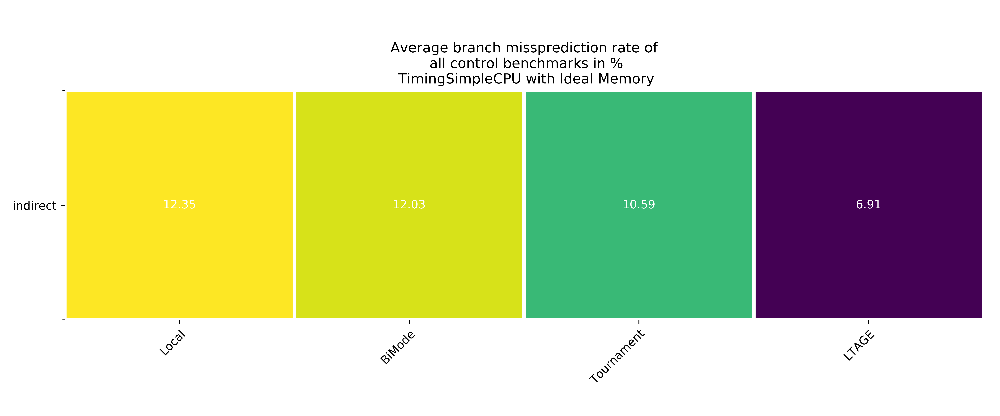
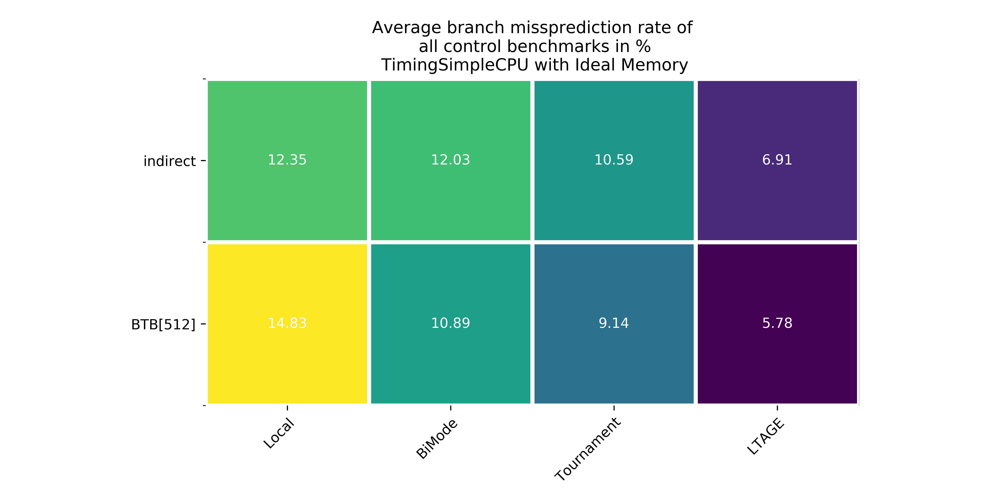
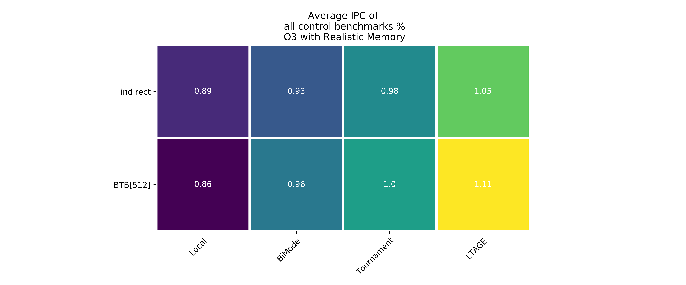
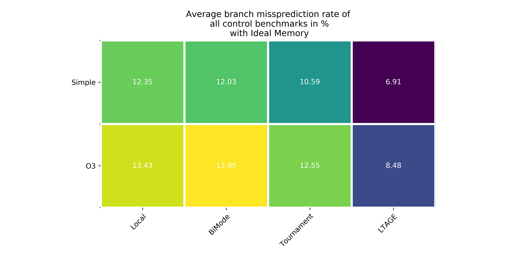
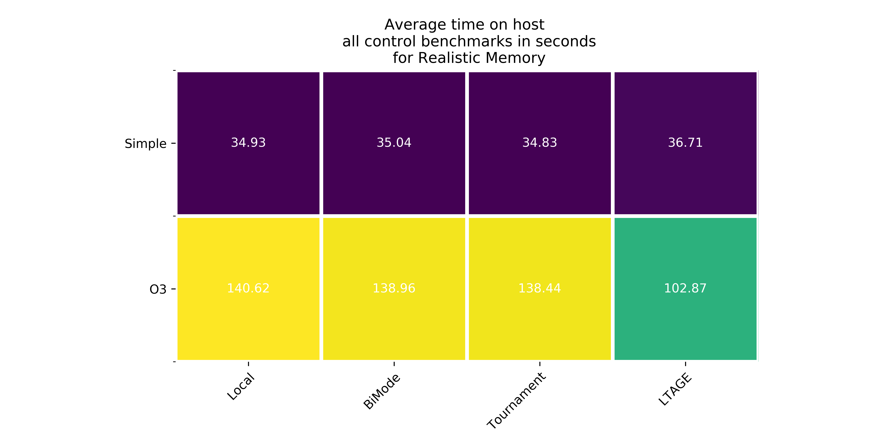

# Branch Predictors

## Branch Predictors in gem5
1. 2-bit local
2. Bi-Mode
3. Tournament
4. Loop predictor
5. TAGE
6. Statistical Corrector
7. Multi Perspective Perceptron predictor

### Local Predictor
The local predictor is a 1 level branch predictor that has a history table in which each entry is a n bit saturating counter. The history table is indexed by the PC, each counter in history table has 2^N states, if it predicts taken, branch target table in the indirector predictor is used obtain the branch address.  

### Bi-mode Predictor
The bi-mode predictor is a two-level branch predictor that has three seprate history arrays: a taken array, a not-taken array, and a choice array. The taken/not-taken arrays are indexed by a hash of the PC and the global history. The choice array is indexed by the PC only. Because the taken/not-taken arrays use the same index, they must be the same size.

The bi-mode branch predictor aims to eliminate the destructive aliasing that occurs when two branches of opposite biases share the same global history pattern. By separating the predictors into taken/not-taken arrays, and using the branch's PC to choose between the two, destructive aliasing is reduced.

### Tournament Predictor
The tournament predictor is a two-level branch predictor, It has a local predictor, which uses a local history table to index into a table of counters, and a global predictor, which uses a global history to index into a table of counters.  A choice predictor chooses between the two.  Both the global history register and the selected local history are speculatively updated.

### LTAGE Predictor
TAGE (TAgged GEometric)is a global-history based branch predictor. It features a PC-indexed bimodal predictor and N partially tagged tables, indexed with a hash of the PC and the global branch history. The different lengths of global branch history used to index the partially tagged tables grow geometrically. A small path history is also used in the hash. L-TAGE also features a loop predictor that records iteration count of loops and predicts accordingly.

All TAGE tables are accessed in parallel, and the one using the longest history that matches provides the prediction (some exceptions apply).Entries are allocated in components using a longer history than the one that predicted when the prediction is incorrect.

## Benchmark Characterization
Control flow benchmarks from Vertical Research Group's [micro-benchmark suite](https://github.com/darchr/microbench) were used to study the branch predictors 

CCa - completely baised branches\
CCm - heavly baised branches\
CCe - easy to predict -- branch pattern (10101010...)\
CCh - impossible to predict -- random branch pattern\
CCh_st - impossible to predict with a store operation\
CCl - impossible to predict with large penality -- large airthmetic work per branch\
CS1 - switch Case Statement of size 10 -- Different Case each time\
CS3 - switch Case Statement of Size 10 -- Different case every third time\


### Branch Missprediction 


- All BPs perform as expected in the case of easy to predict benchmarks such as `CCa`, `CCm` and `CCe`, with an exception only of local BP. This is because, local BP uses 2bit counters in its history table for direction prediction, pattern such as 10101010.. in terms branch behaviour is a limiting sequence for a two bit counter. But we see just 10% miss rate because, the for loops in the benchmark are easy predictable. Same reason also applies to immpossible to predict benchmarks such as `CCh`, `CCh_st` and `CCl`.
```c
int loop(int zero) {
  int t = 0,i,iter;
  for(iter=0; iter < ITERS; ++iter) {
    for(i=0; i < STEP + zero; i+=1) {
      if(randArr[i])  {
        t+=3+3*t;
      } else {
        t-=1-5*t;
      }
    }
  }
  return t;
}
```
- High miss prediction rate in case of control recursive benchmarks such as `CF1`, `CRd`, `CRf` and `CRm` is due the small RAS size(16) used during the experiment.
- Among the four BPs studied LTAGE gives the best overall performance and Tournament gives the best performance in case control recursive benchmarks.


### Impact of target buffer
gem5 by default uses indirect predictor for branch target prediction of conditional branches, the below figure shows the impact of target buffer choice on control flow benchmarks. BTB seems to work better than indirect predictor because these benchmarks do not have enough indirect branches. 



### Impact of host CPU



## Conclusion
Indirect predictor didn't perform better than BTB because these benchmarks do not have enough indirect branches, LTAGE BP has best overall performance and Tournament performs better in case of control recursive benchmarks.

