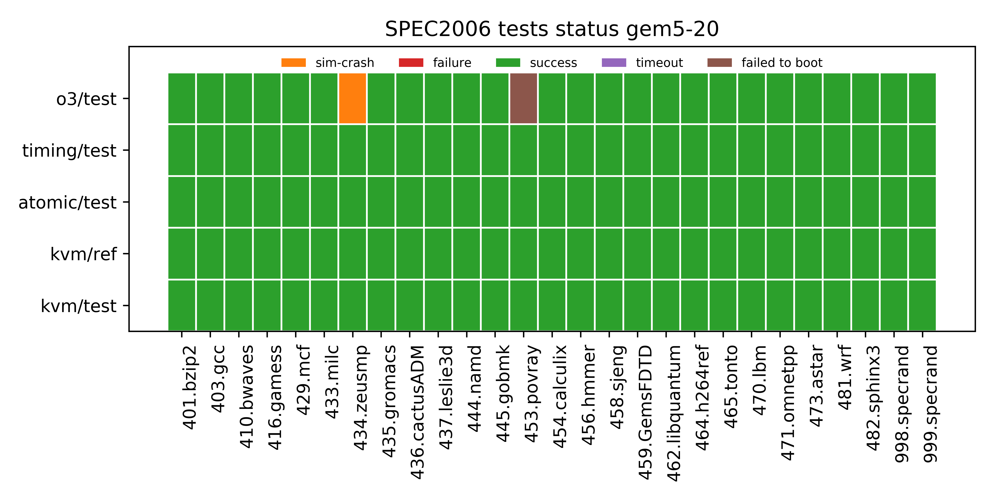
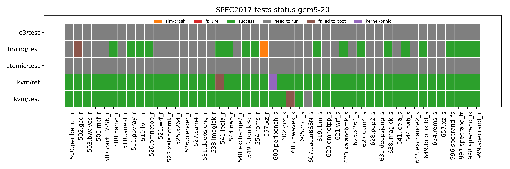

# Boot Tests

The Linux Kernel boot tests rely on 5 LTS kernel releases (4.4.186, 4.9.186, 4.14.134, 4.19.83, and 5.4), four CPU models (kvmCPU, AtomicSimpleCPU, TimingSimpleCPU, O3CPU), three memory systems (classic, MI_Example, MESI_Two_Level) and two boot types (init, systemd).

Following is the description of the possible status of these runs:

**timeout:** experiment did not finish in a reasonable amount of time (12 hours: this time was chosen as we found similar successful cases did not exceed this limit on the same host machine).

**not-supported:** cases which are not yet supported in gem5.

**success:** cases where Linux booted successfully.

**sim-crash:** cases where gem5 crashed.

**kernel-panic:** cases where kernel went into panic during simulation.

# NPB Tests

These NPB tests use KVM CPU (1,8,16,32, and 64 cores) and TimingSimple CPU (1 and 8 cores) with MESI_Two_Level memory system.

It is a known problem that if the number of simulated CPU cores increase, KVM simulations get stuck sometimes.
A work around is to use lower number of event queues than the CPU cores.
Although our scripts do that for more than 1 CPU core, the cases shown as `timeout` in the plot above
suffer from this problem of getting stuck.

There are three cases with TimingSimple CPU which did not finish in the alloted time.
There is no reason apparent in the generated results files (`simout`, `simerr`, `system.pc.com_1.device`).

# PARSEC Tests

# GAPBS Tests

# SPEC 2006 Tests

The following plot represent the status of SPEC2006 workloads for different CPUs and data sizes with respect to gem5-20, linux kernel version 4.19.83 and gcc version 7.5.0.

* Few workloads, [**400.perlbench**, **447.dealII**, **450.soplex**, **483.xalancbmk**] had build errors
* **434.zeusmp** had crashed in gem5-19 as well due a segmentation fault.
* **453.povray** needs a rerun and the test with gem5-19 was a success. 

# SPEC 2017 Tests

The following plot represent the status of SPEC2017 workloads with respect to gem5-20, linux kernel version 4.19.83 and gcc version 7.5.0.

* **600.perlbench_s** kernel panic while booting, couldn't find a reason.